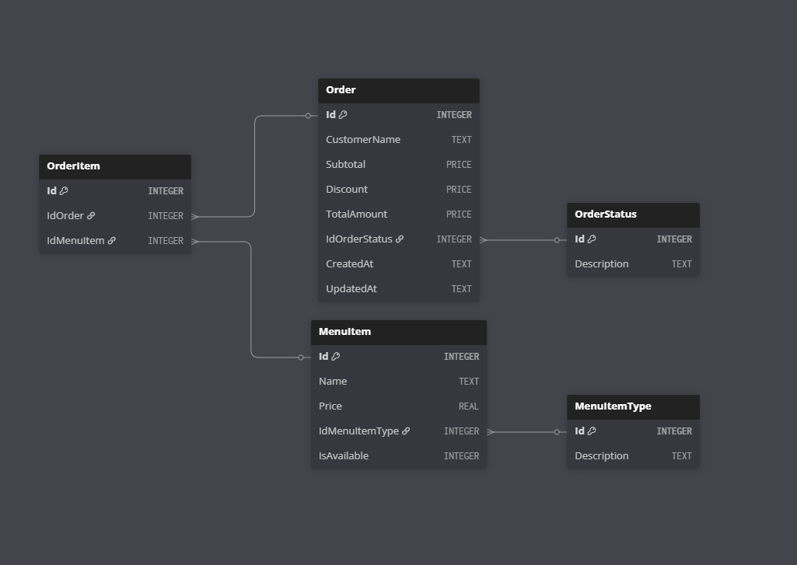
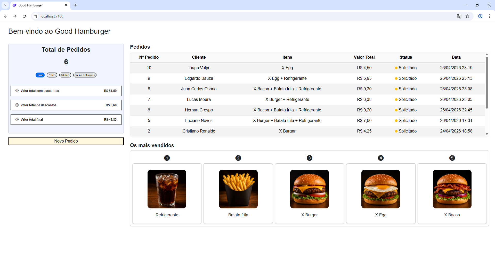
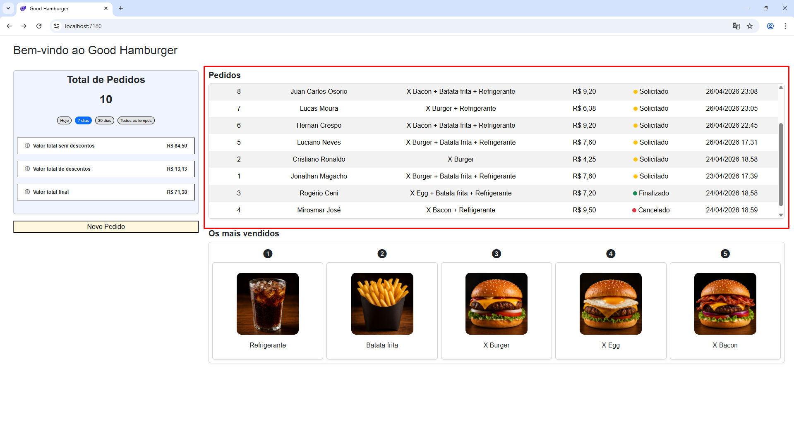
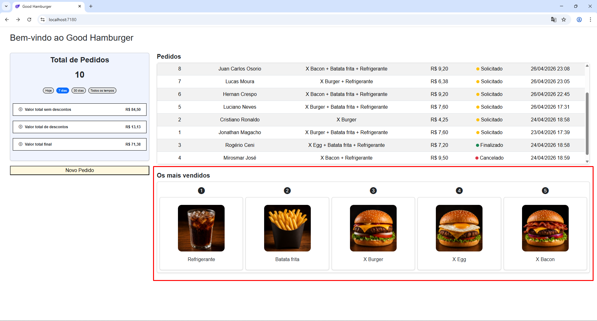
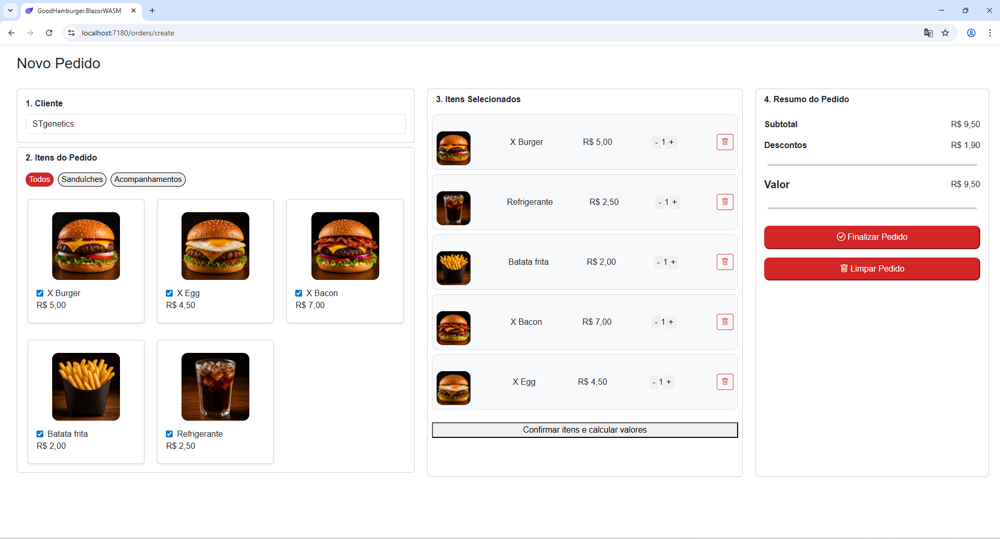
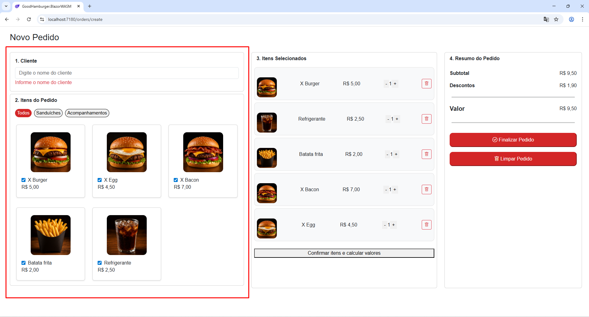
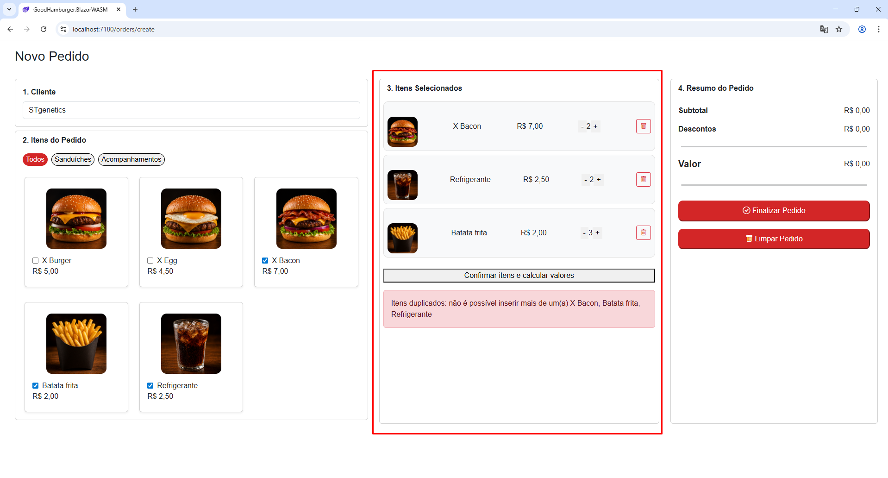
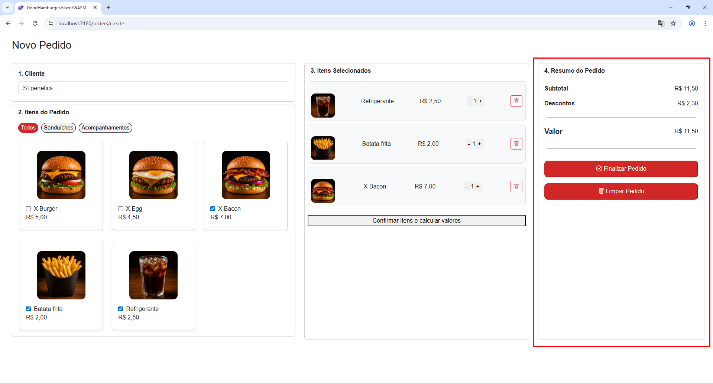

####### Good Hamburger #######

# 1. Descrição do Projeto
Sistema de gestão de uma hamburgueria com foco em facil usabilidade, regras de negócios bem estruturadas e boas práticas de arquitetura e desenvolvimento.

# 2. Tecnologias utilizadas
- Backend: .NET 10 (WebApi - ASP.NET Core)
- Frontend: Blazor WebAssembly
- ORM: EFCore
- Bootstrap 5
- Base de Dados: SQLite
- Arquitetura: Clean Architecture / DDD
- Scalar: Validação e documentação de endpoint

# 3. Base de Dados

# 3.1 Escolha da stack
- Optei por SQLite por ser uma base de dados leve, portátil e sem configurações, o que torna ideal para projetos modelos e facilita o uso para os avaliadores.

# 3.2 Modelagem de Dados
- A modelagem foi pensada para garantir integridade dos dados, flexibilidade na relação entre entidades e consistência histórica dos pedidos da maneira mais simples possível
- Foquei na normalização e separação das responsabilidades pensando em performance e em um eventual crescimento do sistema.
- As principais tabelas são: Order, MenuItem e OrderItem
- Me utilizei do conceito de entidade intermediária (OrderItem) para relacionamentos N:N
- As tabelas OrderStatus e MenuItemTypes são para evitar problemas com variações de strings e garantir a integridade referencial das informações via FK. Isso também facilita a manutenção do sistemas para possíveis futuras inclusões de novos tipos.

# 4. Arquitetura
- Optei pela Clean Architeture por promover baixo acoplamento, alta coesão e separação clara de responsabilidade entre as camadas.
Além disso, o coração do sistema proposto são as regras de negócio o que torna a Clean Architecture o modelo ideal por isolar as regras de negócio na camada de Domínio.
- Outro ganho é referente aos testes, com esse modelo os testes focam totalmente no que importa, que são as regras de negócio.

# 4.1. Camadas e Responsabilidades
- Tests: Testes unitários utilizando xUnit
- WebAPI: Exposição dos endpoints
- Domain: Regras de Negócio.
- Application: Orquestração.
- DataApplication: Objetos de transporte Request e Response, respeitando o Princípio da Responsabilidade Única (SRP)
- Infrastructure: Comunicação com a Base de Dados.
- IoC: Inversão de Dependência, desacopla as camadas, facilita a testabilidade e manutenção do código.
- BlazorWASM: Interface do usuário.

- Fluxo padrão: UI -> WebAPI -> Application -> Domain -> Infrastructure

# 5. Testes Unitários
- O projeto conta com testes unitários utilizando xUnit, focados na validação das regras de negócio da camada de domínio.

# 6. Instruções para execução

# 6.1. Pré-requisitos
- .NET 10 SDK (ou versão compatível instalada)
- Visual Studio 2022+ (preferencialmente) ou VS Code

# 6.2 Passo a passo

# 6.2.2 No Visual Studio
1. Clone o repositório
git clone https://github.com/magach07/GoodHamburger

2. Configure múltiplos projetos de inicialização. Selecione:
- 1. GoodHamburger.WebApi
- 2. GoodHamburger.BlazorWASM

3. Execute o projeto usando IIS Express

4. Se as páginas não abrirem automaticamente
- 1. Backend: https://localhost:44391/scalar/
- 2. Frontend: https://localhost:7180/

# 7. Telas do Usuário

# 7.1. Tela Inicial

- Foco nas informações mais importantes como valores acumulados com filtros dinâmicos, listagem com histórico de pedidos e ranking de itens mais vendidos.

# 7.1.1. Card "Total de Pedido"

- Informações detalhadas sobre valores acumulados.
- Filtros dinâmicos, dando ao usuário a liberadade de escolher suas visualizações.

# 7.1.2. Listagem "Pedidos" 

- Lista os pedidos junto com suas principais informações, permitindo ao usuário rápida visualização de suas vendas.

# 7.1.2. Card "Os mais vendidos"

- De maneira dinâmica, mostra os itens mais vendidos da Good Hamburger.

# 7.2. Novo Pedido

- A ideia foi ter todas as informações na mesma tela, tornando simples e rápido todo o processo de inclusão de um novo pedido.

# 7.2.1 Cliente e Itens do Pedido

- Nessa etapa o usuário informa o nome e seleciona os itens do pedido.
- Há uma tratativa obrigando a inserção de um cliente. Essa tratativa não permite o avanço até seu preenchimento.

# 7.2.2 Itens Selecionados

- Permite de maneira fácil a seleção da quantidade de cada um dos itens e também sua exclusão.
- Aplica as regras de negócios e mostra os erros de maneira clara na tela para o usuário.

# 7.2.3 Resumo do Pedido

- Mostra os valores do pedido de forma detalhada, incluindo o desconto aplicado segundo as regras de itens selecionados.
- Permite finalizar ou limpar pedido.

# 8. Endpoints

# 8.1. Pedidos (Order)
- (GET) api/order: lista todos os pedidos.
- (GET) api/order/summary: retorna um relatório sobre os pedidos incluindo detalhamento de valores.
- (POST) api/orders/validate-insert: endpoint que valida e insere um pedido e seus respectivos itens. Existe apenas para testes de inserção via backend, pois o fluxo do front faz a validação e inserção de maneira apartada.
- (POST) api/orders/validate: valida o pedido de acordo com as regras de negócio explicitadas no escopo do Desafio Técnico.
- (POST) api/orders: faz a inserção do pedido e de seus respectivos itens.
- (DELETE) api/orders/{id}: optei pelo soft delete para evitar problemas de deleção de pedidos que possuem itens vinculados a ele.

# 8.2 Cardápio (MenuItem)
- (GET) api/menu-items: lista todos os itens do cardápio.
- (GET) api/menu-items/{id}: recupera um item do cardápio pelo seu id.

# 9. Ficou de fora
# Por limitação de tempo, algumas melhorias importantes não foram implementadas:
- Autenticação: utilizando JWT Bearer Token
- Pagamentos: integração com algum gateway de pagamento como Mercado Pago ou Pagar.me, que utilizam de webhook para o fluxo completo de pagamento online.
- Tratamento de exceções: gostaria de ter implementado algo mais robusto e confiável, como um tratamento de excessões via middleware, padronizando as respostas e gerando logs para melhorar ainda mais a rastreabilidade de erros.
- Testes mutantes: optei por testes unitários cobrindo as principais regras de negócio. Os testes mutantes seriam importantes para avaliar a efetividade desses mesmos testes, o que eleva significativamente a qualidade da aplicação.
- Imagem do armazenado em nuvem: em um outro contexto, salvaria as imagens de cada item em um container de armazenamento em nuvem como Bucket S3, da amazon, e salvaria na tabela de itens (MenuItem) o caminho do armazenamento. Outra opção mais simples seria de salvar imagem diretamente na base de dados no formato de Blob.

# 10. Considerações finais
- O projeto foi desenvolvido com foco em boas práticas de arquitetura, separação de responsabilidades e escalabilidade. Também tentei seguir ao máximo, como em todo desenvolvimento que faço, os conceitos do Clean Code e os princípios fundamentais do SOLID.